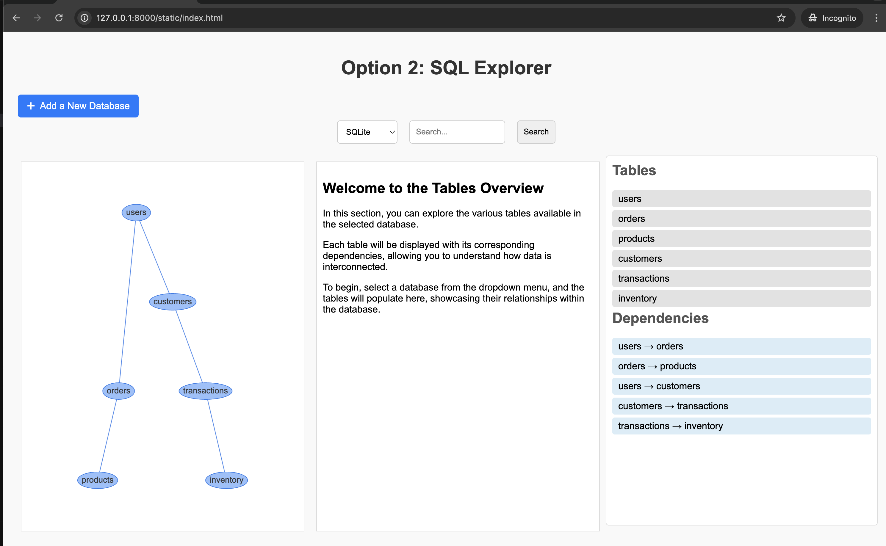
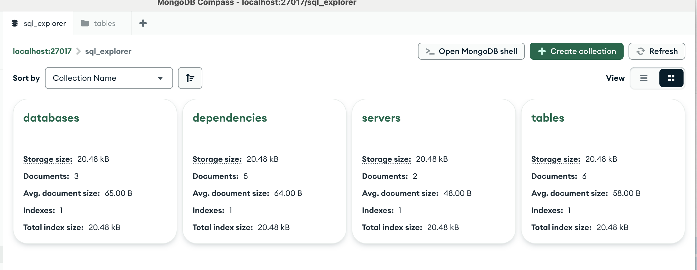

# SQL Explorer

SQL Explorer is a prototype application designed for Database Administrators (DBAs) and SQL developers. This web-based tool allows users to manage and visualize their database environments, providing essential functionalities to search for database objects and understand their relationships.

## Table of Contents

- [Introduction](#introduction)
- [Features](#features)
- [Installation](#installation)
- [Running the Application](#running-the-application)

## Introduction

SQL Explorer addresses the challenges faced by DBAs and SQL developers when exploring and managing database environments. The application provides a user-friendly interface to add databases, search for relevant database objects, and visualize dependencies, enhancing the user's ability to navigate complex database structures.

## Features

- **Add New Databases**: Users can connect and add new databases to the program.
- **Search Functionality**: Discover database objects relevant to user queries through a robust search feature.
- **Dependency Visualization**: View and analyze relationships between tables and databases using appropriate diagrams.
- **Filters for Search Refinement**: Utilize various filters (e.g., table, dependencies) to refine search results and enhance user experience.


## Installation

To set up the project locally, follow these steps:

   **Setting Up MongoDB and SQLite:**
   To set up MongoDB, install it from the [official site](https://www.mongodb.com/try/download/community) and run `mongod`; SQLite is included with Python, and you can create a new database file by specifying its name in your application.


1. **Clone the repository:**
   ```bash
   cd sql-explorer

2. **Create a virtual environment:**
   ```bash
   python -m venv venv

3. **Activate the virtual environment:**


4. **Install the Required Packages**
   ```bash
    pip install -r requirements.txt

## Running the Application
    uvicorn main:app --reload --port 8000

You can access the application in your web browser at http://127.0.0.1:8000. The interactive API documentation can be found at http://127.0.0.1:8000/docs.

## Screenshots

Here are some screenshots of the SQL Explorer application in action:

```mermaid
graph TD
    A[User Interface] --> B[SQL Explorer Tool]
    B --> C[Database Connection]
    B --> D[Search Functionality]
    B --> E[Object Discovery]
    B --> F[Dependency Visualization]
    
    C --> G[Supported Databases]
    D --> H[Cross-Estate Search]
    E --> I[Servers/Databases/Tables]
    F --> J[Relation Diagrams]
    
    G --> K[SQLite]
    G --> L[MongoDB]
    
    D --> M[Filtering Options]


*SQL Explorer system architecture diagram*

graph TD
    A[Client] -->|HTTP Requests| B[FastAPI Application]
    
    B --> C{Database Type}
    C -->|SQLite| D[SQLite Database]
    C -->|MongoDB| E[MongoDB Database]
    
    subgraph "FastAPI Endpoints"
    B --> F[Get Servers]
    B --> G[Get Databases]
    B --> H[Get Tables]
    B --> I[Get Dependencies]
    B --> J[Add Table]
    B --> K[Add Dependency]
    B --> L[Search]
    end
    
    subgraph "Database Models"
    M[SQLite Models]
    N[MongoDB Models]
    O[Pydantic Models]
    end
    
    D <--> M
    E <--> N
    B <--> O
    
    subgraph "Core Functionality"
    P[Database Connection]
    Q[Object Discovery]
    R[Dependency Visualization]
    S[Search and Filtering]
    end
    
    B --> P
    B --> Q
    B --> R
    B --> S
    
    P --> D & E
    Q --> D & E
    R --> I
    S --> L
    
    T[Static Files] --> B
    
    B -->|HTTP Responses| A
    

*Detailed database relationship and functionality flow diagram.*


*Main page with default SQLite connection and pre-inserted data.*


*Overview when selecting a table.*


*Clicking the button to add a new database connection.*


*Feature to insert a new table.*


*Visual representation of the data dependencies.*


*Visual representation of the data dependencies (mongodb).*


*Visual representation of the data dependencies filter search (mongodb).*



*Visual representation of the data (mongodb).*